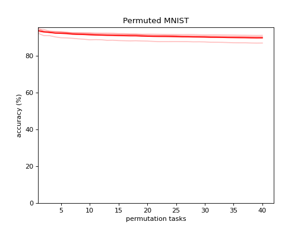
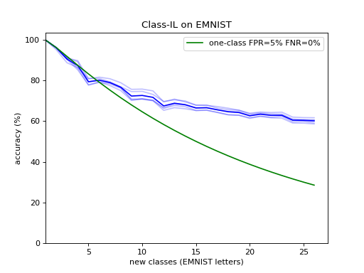

# Meaning-preserving Continual Learning (MPCL)

This is a follow-up to [domain_IL](https://github.com/rom1mouret/domain_IL).
The core idea remains the same but it is framed a bit differently.

```diff
+ 2021 Feb update: MPCL rules are now explained in the slides.
```
Link to [MPCL_v1_slides.pdf](MPCL_v1_slides.pdf)

### Situated meaning

MPCL posits that latent representations acquire meaning by acting on the
outside world.

For continual learning to be manageable in complex environments and avoid
[catastrophic forgetting](https://github.com/rom1mouret/forgetful-networks),
meaning must remain stable over time. This is the core idea behind MPCL.

MPCL borrows ideas from [embodied cognition](https://en.wikipedia.org/wiki/Embodied_cognition),
but I should point out that MPCL is not completely in line with current embodied/situated cognition theories.
In particular, MPCL version1 is very much human-aligned, and not well suited for
dealing with autonomous robots and other forms of embodied intelligence.

In MPCL, meaning is central.
As the inputs and outputs of algorithms have no intrinsic meaning,
it is often the prerogative of the programmer to attach meaning to variables.

There are two kinds of meaning at play here.

1. meaning that emerges from the interplay with the environment. For instance,
frogs might be seeing insects as mere calorie dispensers. Needless to say, humans don't see insects the same way.
2. meaning from the programmer's perspective, which roughly aligns with all the other humans.

Since the programmer's perspective is a byproduct of her environment, it is not
too much of a leap to view her perspective as a gateway to her environment.
This is how I want to get away with explicitly modeling the environment in MPCL v1.
Take for instance a model categorizing x-ray images of tumors into malignant or benign.
If the model is deployed in a hospital, those labels have a tangible impact on the
environment.

So MPCL has two jobs:

- aligning the two kinds of meaning. I believe the more training examples we
provide, the more the first kind converges towards the second kind.
- making sure meaning remains stable.


### Concrete example

Your system's training journey might start like that:
- task A1: time T0 to T1: training the model to recognize human faces.
- task B: time T2 to T3: training the model to tell cats and dogs apart.
- task A2: time T4 to T5: training the model to get better at recognizing human
faces, maybe in a novel environment.

At time T1, your model and its latent units are perfectly fit for recognizing
faces within domains it was trained on.

At time T2, your model moves on to learning to distinguish between cats and dogs.
It can build on task A1's latent layer but it should not interfere with it
because the function of task A1's latent layer is to recognize human faces, not
to recognize human faces AND pets. In programming terms, task A1's network is
entirely frozen between T2 and T3.

At T4, we are back to face recognition.
Task A1's latent representation can be safely refined as long as it keeps on
fulfilling the same invariant function.
This might interfere with Task B, but not in a
[destructive manner](https://en.wikipedia.org/wiki/Catastrophic_interference).

### Theoretical framework

In broad terms, we anchor/tether/ground latent representations by forcing them
to remain good at realizing the function they were originally trained for.
How the system realizes the
function-that-latent-representations-were-originally-trained-for *is* what
defines latent representations.

An important distinction to make is that such functions are not about mapping
some input domain to an output domain.
It's all about the output.
Recognizing faces in photographs fulfills the same function as recognizing faces
in real life.
The input domain hardly matters `*`.
Your friend's face is an abstraction in virtue of the realizability of the same
recognition function across many domains/environments.

Now, my goal is to formalize this idea and characterize the "meaning of latent
units" in more rigorous terms.

[link to MPCL Framework v1 pdf](MPCL-Framework-v1.pdf)

I will also attempt to frame bare-bones [Domain-IL and Class-IL](https://arxiv.org/pdf/1904.07734v1.pdf)
within this framework (see below).
Admittedly, it takes a bit of shoehorning because simple systems don't create
many opportunities for MPCL to take advantage of the complexity to find
inconsistencies, for example by cross-checking predictions from multiple modules
of the system.  
Moreover, complex systems are generally upheld by high-dimensional latent
representations, with a [lot of empty space](https://en.wikipedia.org/wiki/Curse_of_dimensionality#Blessing_of_dimensionality)
wherein you would typically spot inconsistent configurations of latent values.
MPCL relies on finding inconsistencies to detect domain boundaries.

`*` At the very least, *some* of the latent units share the same function
between photographs and real life, while *some* other units' function might be
specialized in specific kinds of domains.

## Domain-IL classification on Permuted MNIST

In this scenario, the most straight-forward approach is to tether the latent
units directly to the output classes.
To do so, we train a classifier to map latent units to classes on an arbitrary
domain and freeze the classifier right away.

Following the naming conventions in [MPCL-Framework-v1](MPCL-Framework-v1.pdf),
*C* is a softmax classifier and *e* is negative cross-entropy.

Next, we train a processor for each domain under the constraint that they must
be good at predicting the target labels.

The tricky part is to detect domain boundaries when making predictions. We have
to resort to using a surrogate function.

Here are the results on [Permuted MNIST](https://arxiv.org/pdf/1312.6211.pdf),
using the confidence of *C* as a surrogate for the degree to which the output
of a processor "conveys meaning".



Multiple rounds are plotted. The average is represented with the most opaque red.

code: [mnist_domain_il.py](mnist_domain_il.py)

## Class-IL on EMNIST

For Class-IL, I chose EMNIST because it includes more classes than MNIST.
The anchoring step is performed on EMNIST digits while the continual learning
and the evaluation are done on EMNIST letters.

MPCL framework doesn't lend itself well to Class-IL, but with a bit of trickery,
EMNIST Class-IL can be expressed as a Domain-IL problem.

- instead of training a classifier to recognize characters, have it predict how
characters are rotated or flipped. This will anchor the latent units just as
well as letter recognition.
- interpret each letter as a distinct domain.

The training algorithm is essentially a copy-paste of MNIST Domain-IL except
that we randomly rotate/flip the training digits on the fly.

#### predicting

All the 7 transformations (90-rotation, horizontal flip etc.) are controlled by
us. Therefore, the expected output of the classifier is always known, even on
the test set.

To make predictions, we apply every transformation to each letter and choose the
domain for which the classifier is the most correct regarding how the letter has
been transformed.



As with Domain-IL, the model was trained with `increment=1`, the most challenging scenario.

code: [emnist_class_il.py](emnist_class_il.py), [plot_emnist.py](plot_emnist.py)

The green curve shows how a collection of one-class classifiers would perform,
under some simplifying assumptions.

- false positive rate is 5%, in the same ballpark as my classifier.
- false negative rate is 0%.
- if multiple classifiers report a positive match, we randomly choose between them.

In simple settings such as MNIST and EMNIST, MPCL boils down to self-supervised
outlier detection. I believe it will prove more fruitful in more complex settings.

## Triangular activation

The layers of the processors are activated by an unusual function.

```python3
class Triangle(torch.nn.Module):
    def forward(self, x):
        return x.abs()
```

With ReLU and the like, out-of-distribution inputs saturate the activation
functions almost as much as in-distribution inputs, which makes ReLU networks
ill-equipped for measuring confidence levels on OOD data.

It is not a matter of calibration.
It's fine for a classifier to be overconfident / underconfident in a consistent
fashion, but we can't afford the network to throw in the towel when it
encounters something it doesn't know.  

I prefer `Triangle` because it doesn't throw anything away, not even noise.
It merely folds the input.

Disclaimer: I haven't studied in depth the dynamics of Triangle-activated
networks so it's possible that Triangle doesn't do what I think it does.
I have noticed improvements on Domain-IL though.

## Softmax

Softmaxing the last layer of the classifier was a mistake and I will try without
softmax in subsequent experiments.
Softmax is not a good choice for MPCL because there are infinite solutions to
`softmax(x) = y`, thus it doesn't constrain `x` enough for `x` (or anything
upstream of `x`) to be transferable to other tasks.

It doesn't affect Permuted MNIST and EMNIST results that much because latent
representations are not transferred to other tasks in our experimental setup.


### Terminology

A *group* of latent units has a *function*.
Within this group, individual latent units have a *meaning*.

It doesn't have to be called "meaning", but the word "meaning" is intuitive
for a number of reasons. First, it has an obvious connection with
intelligibility, a prerequisite to qualifying behavior patterns as rational
or intelligent.
Furthermore, the typical way of detecting inconsistencies is to look for configurations
of latent values that are *meaningless*, in the sense that they do not realize
any function.

I plan on extending MPCL to function-free intrinsic meaning (latent units that get
their meaning from adjacent units), in contrast to extrinsic meaning (latent
units that get their meaning from external labels/feedback).

### FAQ

##### > Must domain/task labels be known at training time?

Yes, this is how I have evaluated my models.
It is not a hard constraint from the framework though.

##### > Must domain/task labels be known at runtime?

No.

##### > Can it be used for regression?

I haven't tried regression with MPCL.
It comes with a few challenges.
1. If the regression model has only one numerical output,
it won't be enough to constrain multi-dimensional latent layers,
unless latent values are sparse or binary.
2. I am not sure what would be the best way to detect inconsistencies from numerical outputs.
Perhaps an ensemble of regressors could reveal discrepancies, or a Bayesian NN.

A workaround is to train the processors with a surrogate classification loss and have the classifier predict
both labels and the desired numerical targets at the same time.

##### > Can an MPCL system run at fixed capacity?

No, the system grows indefinitely as it learns new domains,
but infrequently used domains can be safely removed to free up some space.
Alternatively, they can be distilled down to smaller models.

##### > Can models be revisited later on when new training examples are made available?

Yes.


##### > If domains A and B are similar, does learning A help with learning B?

Not in vanilla MPCL.
But nothing stops you from implementing multi-task learning orthogonally to MPLC.
For instance, you can [implement soft parameter sharing](https://ruder.io/multi-task/index.html#softparametersharing) between processors.

##### > Can trained latent layers be safely connected to other modules without interference risks?

Yes, that's the whole point of MPCL.
When new domains are learned, it is beneficial to downstream modules,
rather than destructive, as in this [zero-shot learning experiment](https://github.com/rom1mouret/domain_IL).

##### > Is there any limitation to the expressive power of MPCL models?

Feature processors can be arbitrarily complex,
though it is better if they don't aggressively filter noise out.
They don't have to be differentiable.
However, the [models mapping latent representations to external labels/actions are highly constrained](MPCL-Framework-v1.pdf).
In practice, linear mapping should do fine.

##### > Does MPCL operate on the same level as common continual learning algorithms such as [EWS](https://arxiv.org/pdf/1612.00796.pdf)?

Not exactly.
The starting point of MPCL is a principle as abstract as [Hebb's rule](https://en.wikipedia.org/wiki/Hebbian_theory) or the [free energy principle](https://en.wikipedia.org/wiki/Free_energy_principle).
Simply put, this principle states that situated meaning must remain stable across time.
MPCL is an attempt to derive an actionable framework from this (somewhat vague) principle.

##### > Must processors be trained one class at a time in the Class-IL setting?

Yes. If you get your data with `increment>1`, split the data into 1-increments.

##### > Isn't just glorified [one-class classification](https://en.wikipedia.org/wiki/One-class_classification) with a surrogate loss?

Maybe.
I haven't pushed MPCL far enough to see if it can bring something truly new to ML.
It would certainly look less like one-class classification if you were to apply it to highly modular architectures.

##### > Does AI have to be modular? Why not a single neural network?

I am agnostic to this question, but MPCL does rely on the assumption that
the system can be broken down into modules.

##### > Is MPCL biologically plausible?

Hopefully it is at some abstract level, but it is definitely not in any general sense
of biological plausibility.
For one thing, brains cannot allocate new feature processors out of thin air.
Also, the outside world is not labeled.


##### > How to train non-differentiable models within this framework?

Processors (inputs -> latent) and classifiers/regressors (latent -> targets) are typically trained conjointly,
which is where gradient descent shines, provided all the models involved are differentiable.

You may be able to get good results
with [coordinate descent](https://en.wikipedia.org/wiki/Coordinate_descent) on non-differentiable models.

Alternatively, if the classifiers/regressors are designed to be analytically invertible,
then you can calculate the latent values that correspond to the targets, and train processors to
predict the latent values as if they were the ground-truth.
